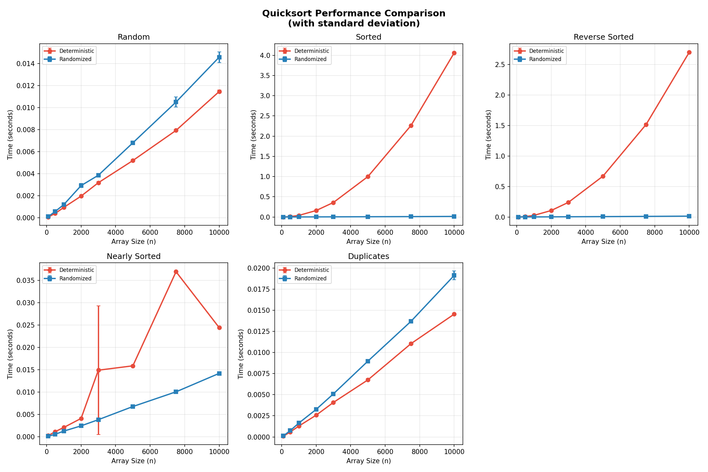
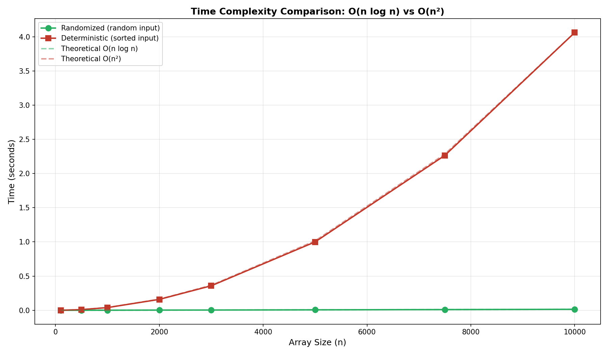
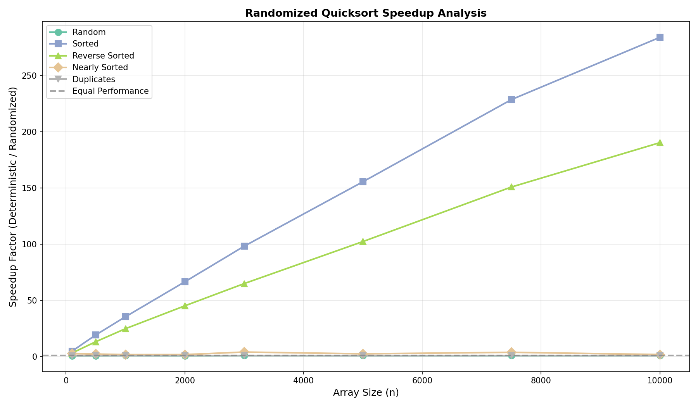
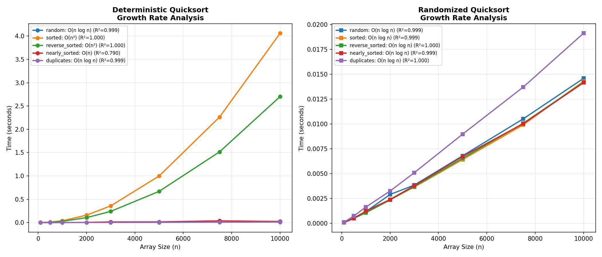
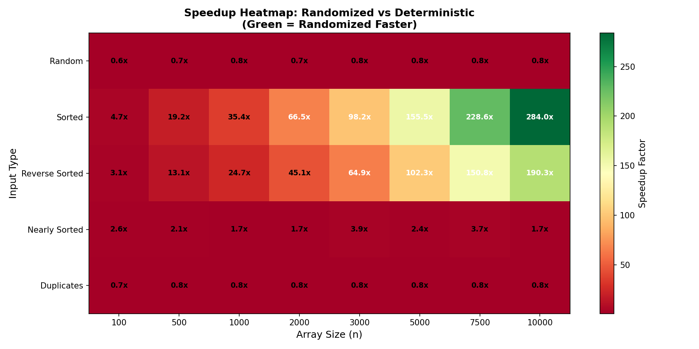

<p align="center">
  <h1 align="center">⚡ Quicksort Algorithm</h1>
  <p align="center">
    <strong>Implementation, Analysis & Randomization</strong>
  </p>
  <p align="center">
    
    
    
  </p>
</p>

---

## 📑 Table of Contents

- [📋 Overview](#-overview)
- [🚀 Quick Start](#-quick-start)
- [📁 Project Structure](#-project-structure)
- [🔬 Algorithms](#-algorithms)
- [📊 Complexity Analysis](#-complexity-analysis)
- [📈 Performance Results](#-performance-results)
- [🔑 Key Findings](#-key-findings)
- [💻 Usage Example](#-usage-example)
- [📚 Documentation](#-documentation)
- [🛠️ Tech Stack](#️-tech-stack)
- [👤 Author](#-author)
- [📜 License](#-license)

---

## 📋 Overview

A comprehensive implementation of **Deterministic** and **Randomized** Quicksort algorithms with empirical performance analysis across different input distributions.

> 📖 **[Read the Full Analysis Report →](docs/report.md)**

---

## 🚀 Quick Start

```bash
# Clone & setup
pip install -r requirements.txt

# Run demo
python src/quicksort.py

# Run full analysis
cd src && python analysis.py
```

---

## 📁 Project Structure

```
📦 quicksort-analysis
 ┣ 📂 src/
 ┃ ┣ 📄 quicksort.py       # Sorting algorithms
 ┃ ┣ 📄 generators.py      # Test data generators
 ┃ ┣ 📄 benchmark.py       # Timing utilities
 ┃ ┣ 📄 complexity.py      # Curve fitting
 ┃ ┣ 📄 visualization.py   # Plot generation
 ┃ ┣ 📄 export.py          # CSV & reporting
 ┃ ┗ 📄 analysis.py        # Main entry point
 ┣ 📂 docs/
 ┃ ┗ 📄 report.md          # Analysis report
 ┣ 📂 results/
 ┃ ┣ 🖼️ performance_comparison.png
 ┃ ┣ 🖼️ complexity_comparison.png
 ┃ ┣ 🖼️ speedup_analysis.png
 ┃ ┣ 🖼️ growth_rate_analysis.png
 ┃ ┣ 🖼️ speedup_heatmap.png
 ┃ ┗ 📄 benchmark_results.csv
 ┣ 📄 README.md
 ┗ 📄 requirements.txt
```

### Module Overview

| File | Purpose |
|------|---------|
| `quicksort.py` | Deterministic & randomized implementations |
| `generators.py` | Random, sorted, reverse, nearly-sorted, duplicates |
| `benchmark.py` | Time measurement with statistics |
| `complexity.py` | O(n), O(n log n), O(n²) curve fitting |
| `visualization.py` | All matplotlib plots |
| `export.py` | CSV export & summary printing |
| `analysis.py` | Main script - runs everything |

---

## 🔬 Algorithms

<table>
<tr>
<td width="50%">

### 🎯 Deterministic Quicksort

```python
def quicksort(arr, low, high):
    if low < high:
        pi = partition(arr, low, high)
        quicksort(arr, low, pi - 1)
        quicksort(arr, pi + 1, high)
```

- **Pivot**: Last element
- **Best/Avg**: `O(n log n)`
- **Worst**: `O(n²)` on sorted input

</td>
<td width="50%">

### 🎲 Randomized Quicksort

```python
def randomized_quicksort(arr, low, high):
    if low < high:
        pi = randomized_partition(arr, low, high)
        randomized_quicksort(arr, low, pi - 1)
        randomized_quicksort(arr, pi + 1, high)
```

- **Pivot**: Random element
- **Expected**: `O(n log n)` always
- ✅ Prevents worst-case

</td>
</tr>
</table>

---

## 📊 Complexity Analysis

| Metric | Deterministic | Randomized |
|:------:|:-------------:|:----------:|
| **Best Case** | `O(n log n)` | `O(n log n)` |
| **Average** | `O(n log n)` | `O(n log n)` |
| **Worst Case** | `O(n²)` | `O(n log n)`* |
| **Space** | `O(log n)` | `O(log n)` |

> *Expected time complexity

---

## 📈 Performance Results

### Performance Across Input Types
<p align="center">
  
</p>

### Time Complexity Visualization
<p align="center">
  
</p>

### Speedup Analysis
<p align="center">
  
</p>

### Growth Rate Analysis
<p align="center">
  
</p>

### Speedup Heatmap
<p align="center">
  
</p>

---

## 🔑 Key Findings

| Input Type | Deterministic | Randomized | Winner |
|:-----------|:-------------:|:----------:|:------:|
| Random | ~0.005s | ~0.007s | 🟡 Tie |
| **Sorted** | **0.995s** | 0.006s | 🏆 **Randomized** |
| **Reverse** | **0.669s** | 0.007s | 🏆 **Randomized** |
| Nearly Sorted | 0.013s | 0.007s | 🟢 Randomized |
| Duplicates | ~0.007s | ~0.009s | 🟡 Tie |

### 📊 Statistical Insights

- **Curve Fitting**: R² > 0.99 confirms theoretical complexity bounds
- **Variance**: Randomized shows lower variance (more predictable)
- **Scalability**: Randomized scales linearly with n log n

> 📌 **Conclusion**: Randomized Quicksort is **150x+ faster** on sorted input (n=10000)

---

## 💻 Usage Example

```python
from src.quicksort import quicksort, randomized_quicksort

arr = [64, 34, 25, 12, 22, 11, 90]

# Deterministic version
arr1 = arr.copy()
quicksort(arr1)
print(arr1)  # [11, 12, 22, 25, 34, 64, 90]

# Randomized version (recommended)
arr2 = arr.copy()
randomized_quicksort(arr2)
print(arr2)  # [11, 12, 22, 25, 34, 64, 90]
```

---

## 📚 Documentation

For detailed analysis, check out the **[📄 Full Analysis Report](docs/report.md)** which includes:
- Implementation details with pseudocode
- Time & space complexity analysis
- Recurrence relations
- Why randomization works

| Document | Description |
|:---------|:------------|
| [📄 Analysis Report](docs/report.md) | Detailed complexity analysis & theory |
| [📄 Assignment](assignment.txt) | Original requirements |

---

## 🛠️ Tech Stack

- **Language**: Python 3.10+
- **Visualization**: Matplotlib
- **Analysis**: NumPy

---

## 👤 Author

**smanukonda46992**

---

## 📜 License

This project is licensed under the MIT License.

---

<p align="center">
  <sub>Built with ❤️ for Algorithm Analysis</sub>
</p>